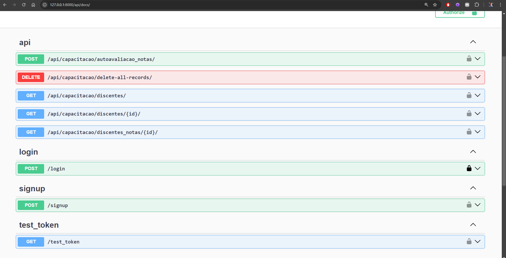

# Tutorial de Instalação da Aplicação Django

## 1. Requisitos de Software

Antes de instalar a aplicação Django, certifique-se de que os seguintes pacotes estejam instalados no servidor:

- **Python 3.x** (Recomendado Python 3.8 ou superior)
- **Pip** (Gerenciador de pacotes do Python)
- **Virtualenv** (Para isolar as dependências da aplicação)
- **Git** (Para clonar o repositório da aplicação)

## 2. Preparação do Ambiente

### 2.1 Atualizar o sistema

Execute os seguintes comandos para garantir que o sistema está atualizado:

```bash
sudo apt update 
sudo apt upgrade
```

### 2.2 Instalar dependências necessárias

Instale o Python, Pip e outras dependências para configurar o ambiente:

```bash
sudo apt install python3-pip python3-dev libpq-dev git
```

## 3. Instalação da Aplicação

### 3.1 Clonar o repositório da aplicação

Navegue até o diretório onde deseja instalar a aplicação e clone o repositório:

```bash
git clone https://github.com/Automacao-Inteligente-GPS/automacao_softskills
```

### 3.2 Criar um ambiente virtual

Crie um ambiente virtual para a aplicação:

```bash
python3 -m venv venv 
source venv/bin/activate
```

### 3.3 Instalar dependências da aplicação

Com o ambiente virtual ativado, instale as dependências da aplicação definidas no arquivo requirements.txt:

```bash
pip install -r requirements.txt
```

### 3.4 Configurar variáveis de ambiente

Edite o arquivo de configuração do Django (settings.py) ou crie um arquivo .env contendo as variáveis de ambiente necessárias, como: (para secret_key utilize https://djecrety.ir para gerar uma)

```bash
SECRET_KEY=sua_secret_key
ALLOWED_HOSTS=*
CORS_ALLOWED_ORIGINS=http://localhost
DEBUG=True
```

### 3.5 Migrar o banco de dados

Para aplicar as migrações e configurar o banco de dados, execute o seguinte comando:

```bash
python manage.py migrate
```

### 3.6 Coletar arquivos estáticos

Colete todos os arquivos estáticos da aplicação (CSS, JavaScript, imagens, etc.) em um diretório central:

```bash
python manage.py collectstatic
```

### 3.7 Criar superusuário (admin)

Use este comando para criar um superusuário, necessário para acessar o painel de admin do sistema (/admin).

```bash
python manage.py createsuperuser
```

### 3.8 Testar a aplicação localmente

ntes de entregar a aplicação para o time de infraestrutura, teste-a para garantir que tudo está funcionando corretamente. Execute a aplicação no servidor local para verificar o funcionamento:

```bash
python manage.py runserver
```

## 4. Endpoints
 


